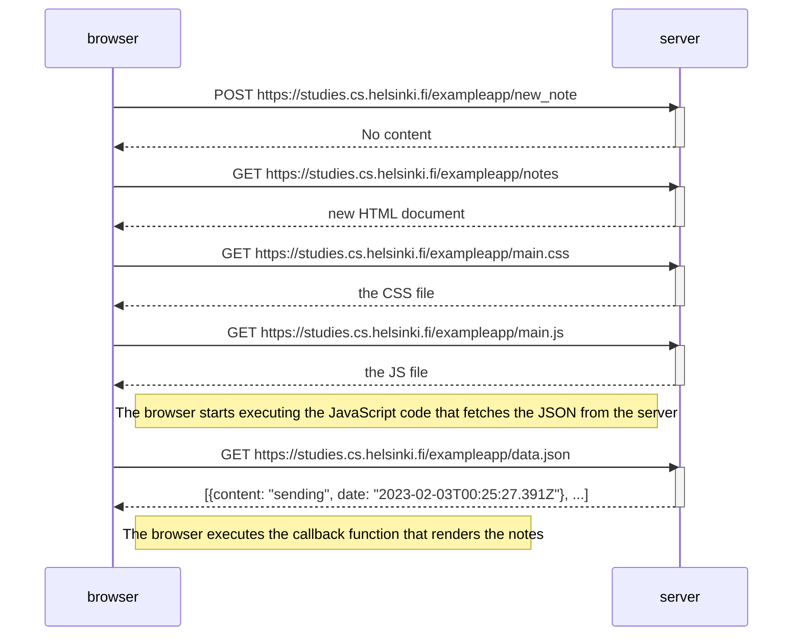
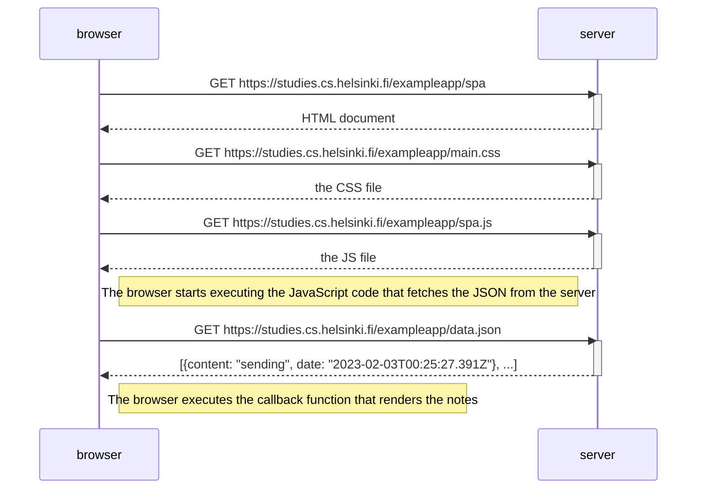
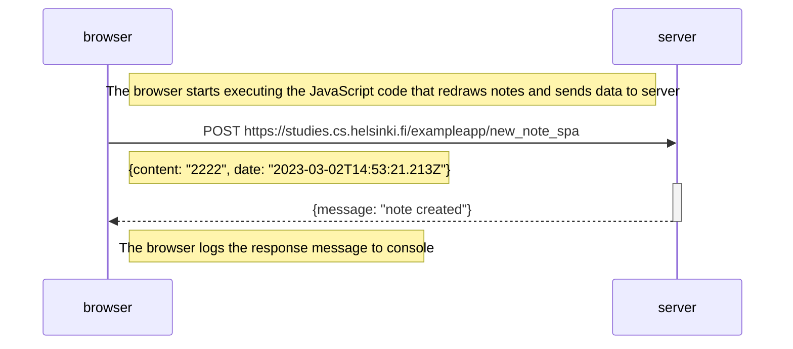

## 0.4 New note diagram

```mermaid
sequenceDiagram
    participant browser
    participant server
    browser->>server: POST https://studies.cs.helsinki.fi/exampleapp/new_note
    activate server
    server-->>browser: No content
    deactivate server
    browser->>server: GET https://studies.cs.helsinki.fi/exampleapp/notes
    activate server
    server-->>browser: new HTML document
    deactivate server
    browser->>server: GET https://studies.cs.helsinki.fi/exampleapp/main.css
    activate server
    server-->>browser: the CSS file
    deactivate server
    browser->>server: GET https://studies.cs.helsinki.fi/exampleapp/main.js
    activate server
    server-->>browser: the JS file
    deactivate server
    Note right of browser: The browser starts executing the JavaScript code that fetches the JSON from the server
        
    browser->>server: GET https://studies.cs.helsinki.fi/exampleapp/data.json
    activate server
    server-->>browser: [{content: "sending", date: "2023-02-03T00:25:27.391Z"}, ...]
    deactivate server
    Note right of browser: The browser executes the callback function that renders the notes 
```

## 0.5 Single page app diagram

```mermaid
sequenceDiagram
    participant browser
    participant server
    browser->>server: GET https://studies.cs.helsinki.fi/exampleapp/spa
    activate server
    server-->>browser: HTML document
    deactivate server
    browser->>server: GET https://studies.cs.helsinki.fi/exampleapp/main.css
    activate server
    server-->>browser: the CSS file
    deactivate server
    browser->>server: GET https://studies.cs.helsinki.fi/exampleapp/spa.js
    activate server
    server-->>browser: the JS file
    deactivate server
    Note right of browser: The browser starts executing the JavaScript code that fetches the JSON from the server
        
    browser->>server: GET https://studies.cs.helsinki.fi/exampleapp/data.json
    activate server
    server-->>browser: [{content: "sending", date: "2023-02-03T00:25:27.391Z"}, ...]
    deactivate server
    Note right of browser: The browser executes the callback function that renders the notes 
```

## 0.6: New note in Single page app diagram

```mermaid
sequenceDiagram
    participant browser
    participant server
    Note right of browser: The browser starts executing the JavaScript code that redraws notes and sends data to server
    browser->>server: POST https://studies.cs.helsinki.fi/exampleapp/new_note_spa
    Note right of browser: {content: "2222", date: "2023-03-02T14:53:21.213Z"}
    activate server
    server-->>browser: {message: "note created"}
    deactivate server
    Note right of browser: The browser logs the response message to console
```

